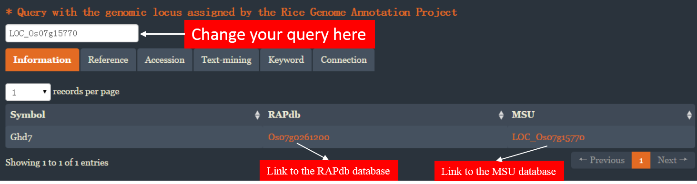
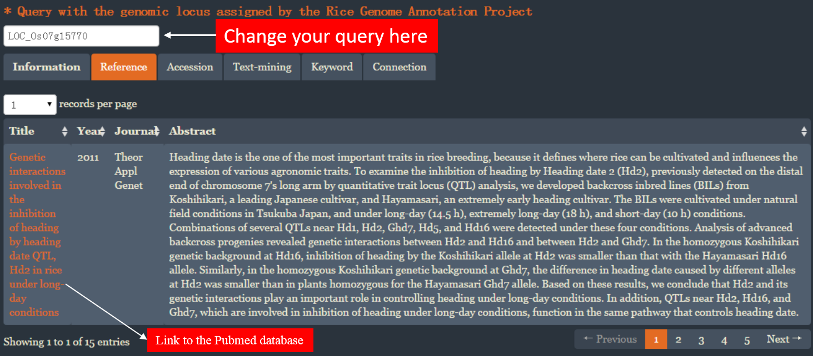
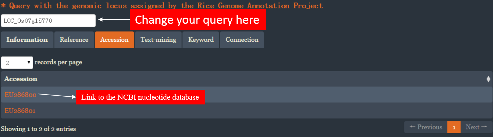
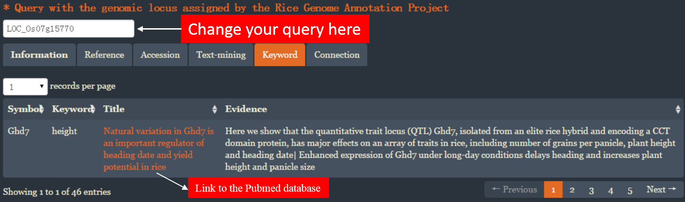
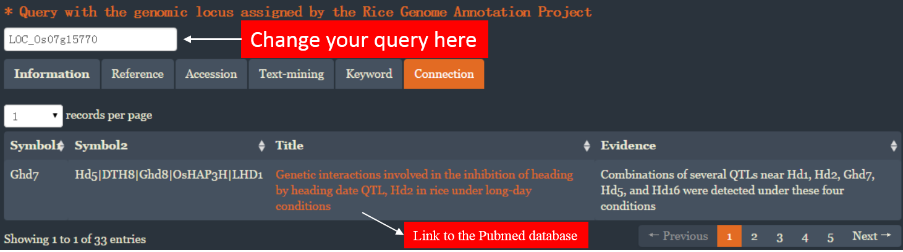
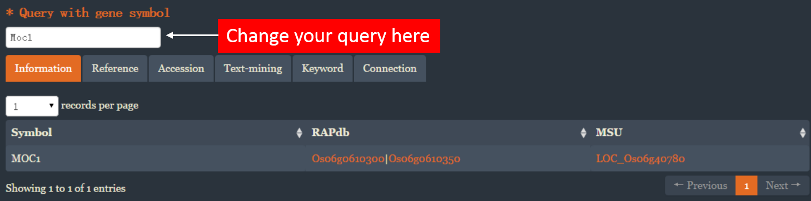



__The knowledge of cloned rice genes lost in the information of rice functional genomic studies__

## Introdution
We collected 2204 cloned rice genes and 303 gene families comprised of 3381 genes. For each gene, 
various information concerning the gene symbol, the genomic locus in the Nipponbare reference genome, 
the Genbank accession number, the title, journal, year, author affiliation, abstract of related 
publications and the text mining result of the publications were provided.

This database was provided as a shiny application. To query this database, you need to install RStudio
and the shiny package.

    
## How to query this database?

### The simple way
This database was designed as a Shiny application and was deployed in the shinyapps.io. You can query this database [HERE](https://ricencode.shinyapps.io/RICENCODE/).
You can query this database using the genomic locus assigned by the Rice Genome Annotation Project. A total of 5 tables exhibiting different information for a gene were given.   

#### The basic information
  

#### The publications
   

#### The Genbank accession numbers
  

#### The keyword to characterize agronomic traits
  

#### The connection to other genes
  

You can also query this database using the genomic locus assigned by the Rice Annotation Project. A total of 5 tables exhibiting different information for a gene were given. 
  

You can also query this database using the gene symbol. A total of 5 tables exhibiting different information for a gene were given. 
  

### The hard way

## How to contribute to this database?

### The simple way
This database was designed as a Shiny application and was deployed in the shinyapps.io. You can submit data to this database [HERE](https://ricencode.shinyapps.io/RICENCODE/).

### The hard way

